# Samsung RISC-V Workshop Documentation

Welcome to the Samsung Semiconductor RISC-V Workshop documentation! This workshop explores the open-source RISC-V architecture using the VSDSquadron Mini RISC-V development board. As a leader in technology, Samsung is committed to advancing RISC-V technology and fostering innovation through education and collaboration.

## Table of Contents
- [Task 1: RISC-V ISA and GNU Toolchain](#task-1-risc-v-isa-and-gnu-toolchain)
- [Task 2: Samsung RISC-V Processor Architecture Analysis](#task-2-samsung-risc-v-processor-architecture-analysis)
- [Task 3: RISC-V Instruction Analysis](#task-3-risc-v-instruction-analysis)

## Task 1: RISC-V ISA and GNU Toolchain

### Overview
This task introduces the fundamental concepts of RISC-V Instruction Set Architecture (ISA) and sets up the development environment using the VSDSquadron board.

### Implementation Steps

#### 1. Commands to run C program in Ubantu
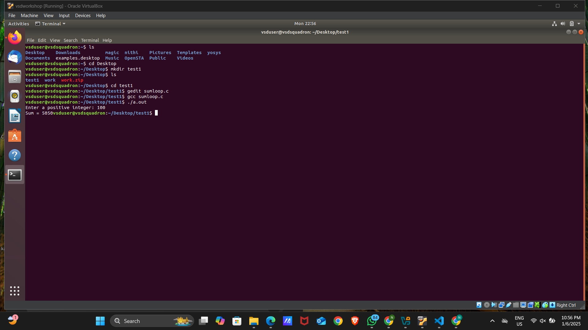

#### 2. C program for Sum of n integer
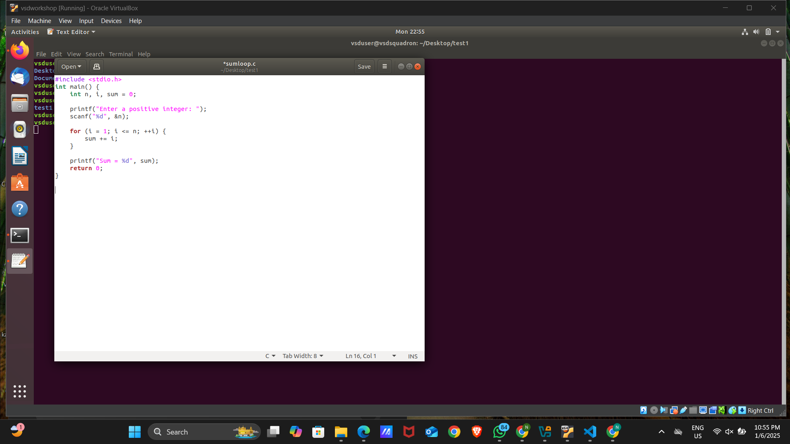

#### 3. Commands for Examination of generated RISC-V assembly code
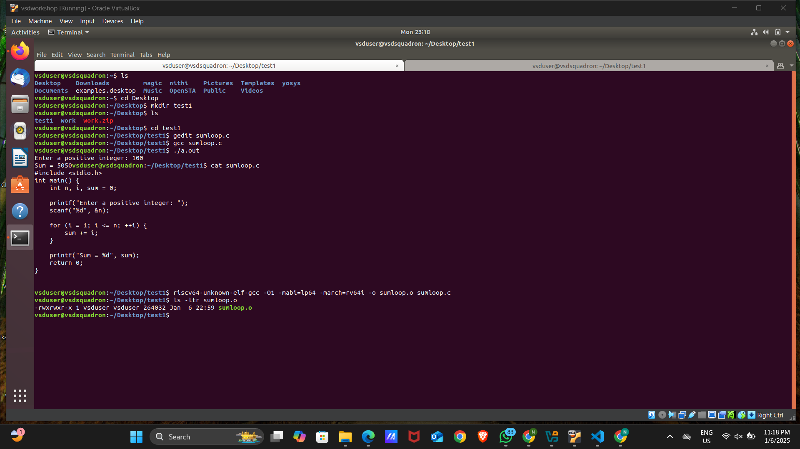

#### 4. Memory Architecture Analysis (main function)
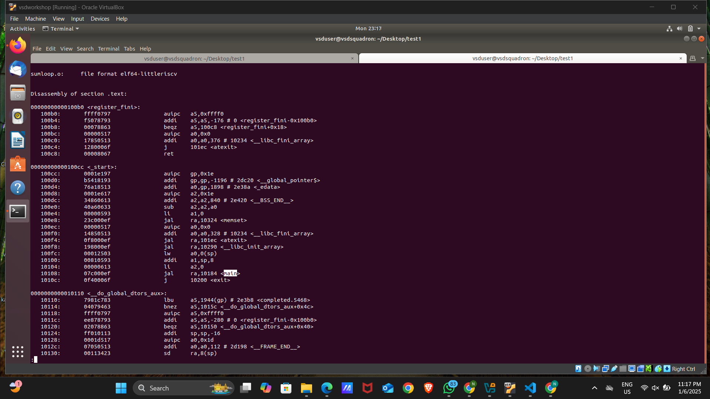

## Task 2: Samsung RISC-V Processor Architecture Analysis

Spike is a free, open-source C++ simulator for the RISC-V ISA that models a RISC-V core and cache system. It can be used to run programs and a Linux kernel, and can be a starting point for running software on a RISC-V target.

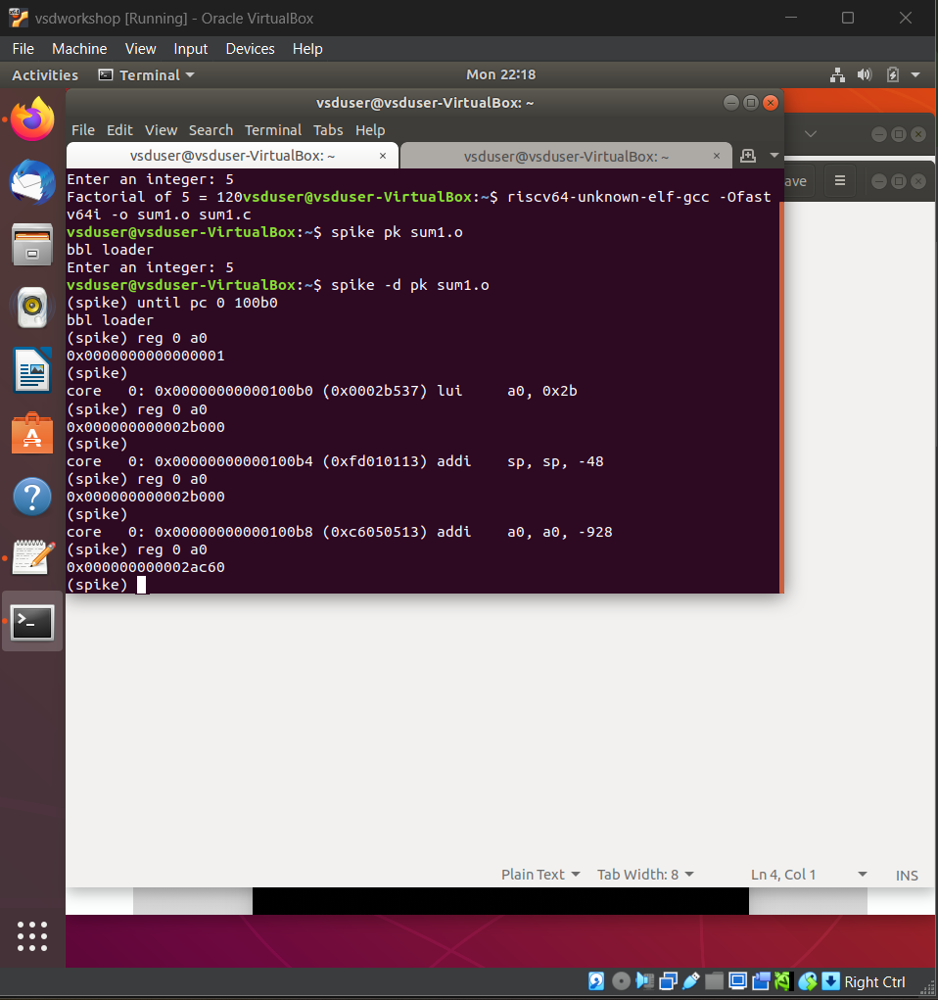

## Task 3: RISC-V Instruction Analysis

# RISC-V Instruction Analysis - Task 3

## Screenshots Analysis

### 1. Basic Instructions Objdump
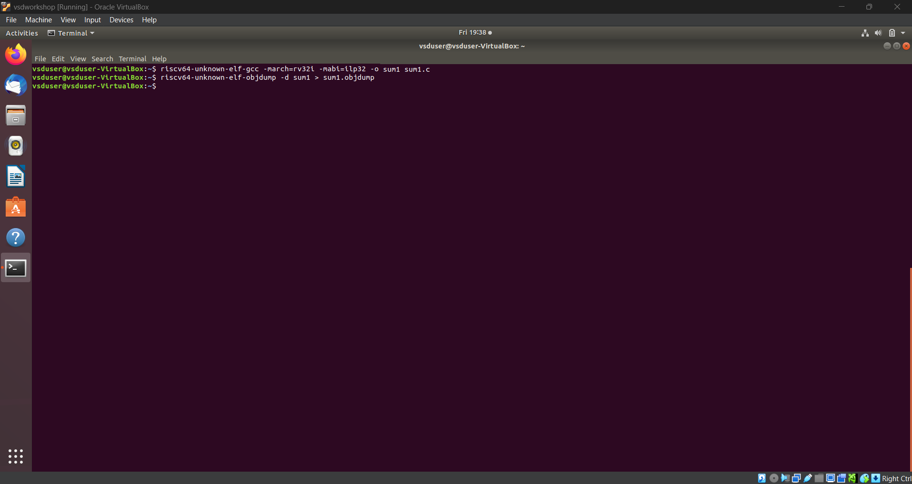
Initial objdump output showing basic instructions

### 2. R-Type Instructions
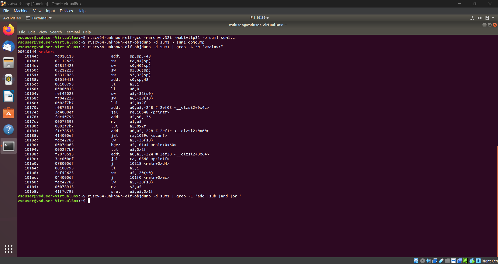
Register-type instructions (ADD, SUB, SLL, SRL, OR, AND)

### 3. I-Type Instructions
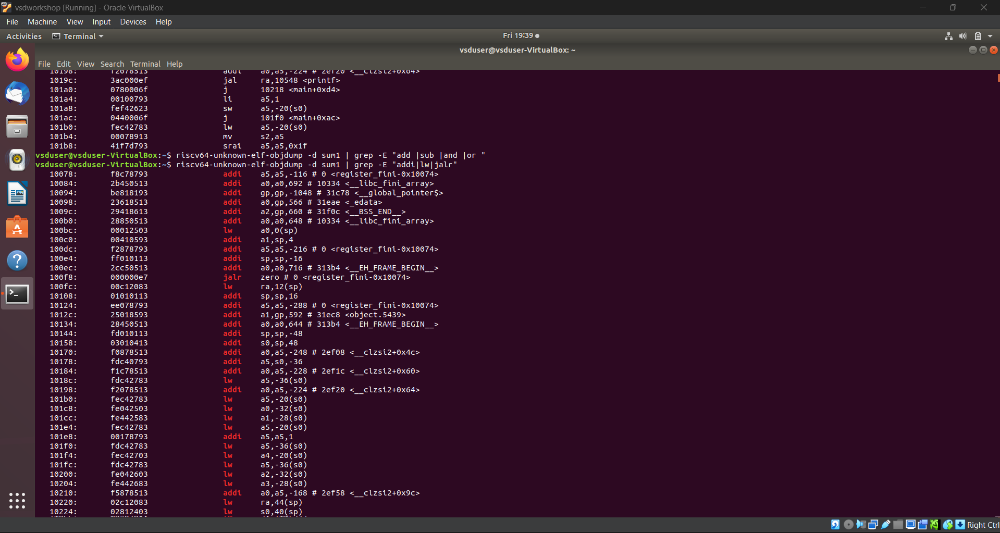
Immediate-type instructions (ADDI, LW, JALR)

### 4. S-Type and B-Type Instructions
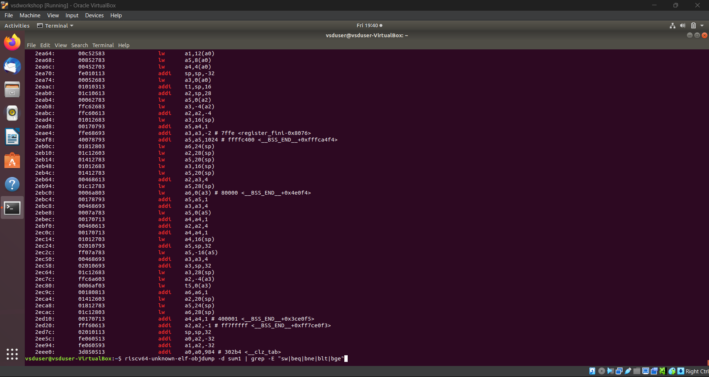
Store and Branch type instructions (SW, BEQ, BNE)

### 5. U and J -Type Instructions
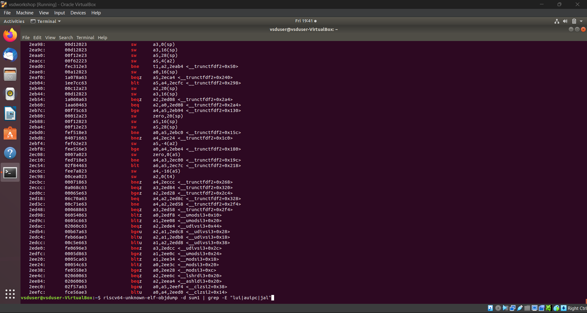
Upper immediate instructions (LUI, AUIPC)

### 7. Instruction Summary
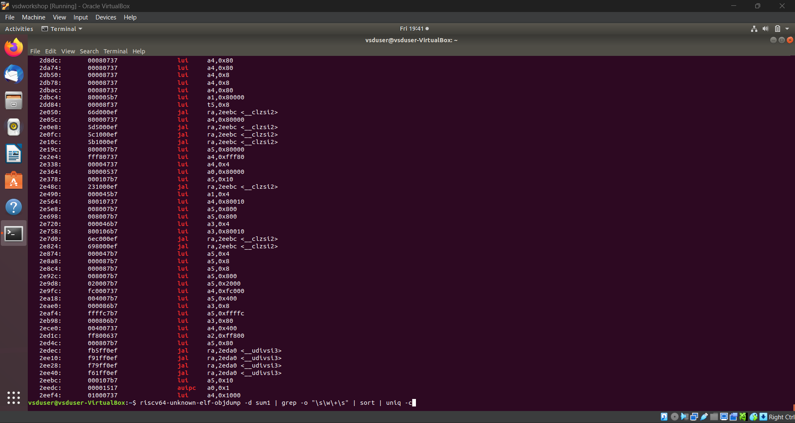
Complete instruction set summary and verification

## Objective
Analysis of 15 unique RISC-V instructions from application code, including their 32-bit instruction patterns and formats.

## Instruction Format Overview
- **R-type**: Register-register operations (add, sub, sll, slt, sltu, xor, srl, sra, or, and)
- **I-type**: Immediate & load operations (addi, lw, jalr)
- **S-type**: Store operations (sw, sb, sh)
- **B-type**: Branch operations (beq, bne, blt, bge)
- **U-type**: Upper immediate operations (lui, auipc)
- **J-type**: Jump operations (jal)

## Instructions Analyzed

### 1. LUI (U-type)
- **Binary**: 0x00001537
- **Format**: lui a0,0x1
- **Fields**:
  - opcode: 0110111
  - rd: 01010 (a0)
  - imm[31:12]: 000000000001

### 2. ADDI (I-type)
- **Binary**: 0x00150513
- **Format**: addi a0,a0,1
- **Fields**:
  - opcode: 0010011
  - rd: 01010 (a0)
  - funct3: 000
  - rs1: 01010 (a0)
  - imm[11:0]: 000000000001

### 3. JAL (J-type)
- **Binary**: 0x008000EF
- **Format**: jal ra,800
- **Fields**:
  - opcode: 1101111
  - rd: 00001 (ra)
  - imm[20:1]: 00000001000

### 4. BEQ (B-type)
- **Binary**: 0x00050863
- **Format**: beq a0,zero,10
- **Fields**:
  - opcode: 1100011
  - funct3: 000
  - rs1: 01010 (a0)
  - rs2: 00000 (zero)
  - imm[12:1]: 000000001000

### 5. LW (I-type)
- **Binary**: 0x0004A503
- **Format**: lw a0,0(s1)
- **Fields**:
  - opcode: 0000011
  - rd: 01010 (a0)
  - funct3: 010
  - rs1: 01001 (s1)
  - imm[11:0]: 000000000000

### 6. SW (S-type)
- **Binary**: 0x00A4A023
- **Format**: sw a0,0(s1)
- **Fields**:
  - opcode: 0100011
  - funct3: 010
  - rs1: 01001 (s1)
  - rs2: 01010 (a0)
  - imm[11:0]: 000000000000

### 7. ADD (R-type)
- **Binary**: 0x00B50533
- **Format**: add a0,a0,a1
- **Fields**:
  - opcode: 0110011
  - rd: 01010 (a0)
  - funct3: 000
  - rs1: 01010 (a0)
  - rs2: 01011 (a1)
  - funct7: 0000000

### 8. SUB (R-type)
- **Binary**: 0x40B50533
- **Format**: sub a0,a0,a1
- **Fields**:
  - opcode: 0110011
  - rd: 01010 (a0)
  - funct3: 000
  - rs1: 01010 (a0)
  - rs2: 01011 (a1)
  - funct7: 0100000

### 9. JALR (I-type)
- **Binary**: 0x00008067
- **Format**: jalr zero,0(ra)
- **Fields**:
  - opcode: 1100111
  - rd: 00000 (zero)
  - funct3: 000
  - rs1: 00001 (ra)
  - imm[11:0]: 000000000000

### 10. AUIPC (U-type)
- **Binary**: 0x00000517
- **Format**: auipc a0,0
- **Fields**:
  - opcode: 0010111
  - rd: 01010 (a0)
  - imm[31:12]: 000000000000

### 11. OR (R-type)
- **Binary**: 0x00B56533
- **Format**: or a0,a0,a1
- **Fields**:
  - opcode: 0110011
  - rd: 01010 (a0)
  - funct3: 110
  - rs1: 01010 (a0)
  - rs2: 01011 (a1)
  - funct7: 0000000

### 12. AND (R-type)
- **Binary**: 0x00B57533
- **Format**: and a0,a0,a1
- **Fields**:
  - opcode: 0110011
  - rd: 01010 (a0)
  - funct3: 111
  - rs1: 01010 (a0)
  - rs2: 01011 (a1)
  - funct7: 0000000

### 13. BNE (B-type)
- **Binary**: 0x00051863
- **Format**: bne a0,zero,10
- **Fields**:
  - opcode: 1100011
  - funct3: 001
  - rs1: 01010 (a0)
  - rs2: 00000 (zero)
  - imm[12:1]: 000000001000

### 14. SLL (R-type)
- **Binary**: 0x00B51533
- **Format**: sll a0,a0,a1
- **Fields**:
  - opcode: 0110011
  - rd: 01010 (a0)
  - funct3: 001
  - rs1: 01010 (a0)
  - rs2: 01011 (a1)
  - funct7: 0000000

### 15. SRL (R-type)
- **Binary**: 0x00B55533
- **Format**: srl a0,a0,a1
- **Fields**:
  - opcode: 0110011
  - rd: 01010 (a0)
  - funct3: 101
  - rs1: 01010 (a0)
  - rs2: 01011 (a1)
  - funct7: 0000000

## Summary
- Total Instructions Analyzed: 15
- Instruction Types Used:
  - R-type: 6 instructions
  - I-type: 3 instructions
  - S-type: 1 instruction
  - B-type: 2 instructions
  - U-type: 2 instructions
  - J-type: 1 instruction

## License
This project documentation is licensed under the MIT License.
